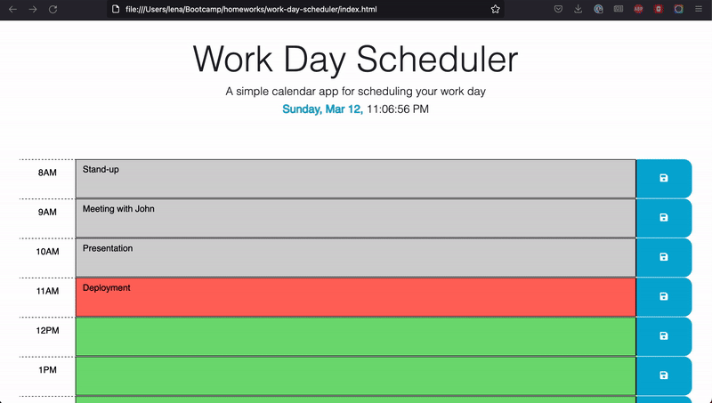

# Work Day Scheduler
>The Work Day Scheduler was developed as a component of the Berkeley Coding Bootcamp Challenge 5. It includes time slots spanning from 8:00 AM to 5:00 PM, allowing users to create and adjust events in each block as a way to manage their work schedule. The starter code for this project was downloaded from [_coding-boot-camp_](https://github.com/coding-boot-camp/crispy-octo-meme). The development of the application was done accordingly to [user story](#user-tory) and [acceptance criteria](#acceptance-criteria).

> Live demo [_here_](https://userolena.github.io/work-day-scheduler/).

## Table of Contents
* [General Info](#general-information)
* [Technologies Used](#technologies-used)
* [Preview](#preview)
* [Setup](#setup)
* [Usage](#usage)
* [Features](#features)
* [Project Status](#project-status)
* [User Story](#user-tory)
* [Acceptance Criteria](#acceptance-criteria)
* [Contact](#contact)
* [License](#license)


## General Information
- The primary objective of the Work Day Scheduler is to assist users in organizing their work schedule.
- Users have the ability to create and modify events in each of the time slots between 8:00 AM to 5:00 PM.


## Technologies Used
- JavaScript
- HTML5
- CSS
- Local Storage
- JSON
- JQUERY


## Preview



## Setup
There is no need for installation as the web application is readily available for use [_here_](https://userolena.github.io/work-day-scheduler/)


## Usage
- To create an event, user can click on a specific time slot and then type in the details of the event.
- After entering the event details, the user can save it to the local storage by clicking on the "save" button.
- To modify an existing event, user can click on the respective time slot and enter a new event description.
- After making changes to the event, user can save it by clicking on the "save" button, which will overwrite the previous version of the event in the local storage for respective time slot.
- The events saved by user will continue to appear in their respective time slots even if the page is refreshed, as they are stored in the local storage.
- To delete events, user can click on the "delete events" button located at the bottom of the web page.

## Features
- The header of the page displays the current real-world time.
- Each time slot is color-coded to indicate whether it is in the past, present, or future based on the current real-world time. If the time slot has a gray background, it means the event is in the past. If it has a red background, it means the event is currently taking place. Finally, if it has a green background, it indicates that the event is in the future.
- When user clicks on the "save" button, the event details are saved to the local storage.
- If user modifies the event description and clicks on the "save" button, the updated event details will overwrite the previously saved event in the local storage.
- The "delete" button located at the bottom of the page can be used to delete previously saved events from the local storage.


## Project Status
Project is: _complete_ 


## User Story

```md
AS AN employee with a busy schedule
I WANT to add important events to a daily planner
SO THAT I can manage my time effectively
```


## Acceptance Criteria

```md
GIVEN I am using a daily planner to create a schedule
WHEN I open the planner
THEN the current day is displayed at the top of the calendar
WHEN I scroll down
THEN I am presented with timeblocks for standard business hours
WHEN I view the timeblocks for that day
THEN each timeblock is color coded to indicate whether it is in the past, present, or future
WHEN I click into a timeblock
THEN I can enter an event
WHEN I click the save button for that timeblock
THEN the text for that event is saved in local storage
WHEN I refresh the page
THEN the saved events persist
```


## Contact
Created by [Olena P](https://github.com/UserOlena) 


## License
This project is open source and available under the [MIT License](https://en.wikipedia.org/wiki/MIT_License).

